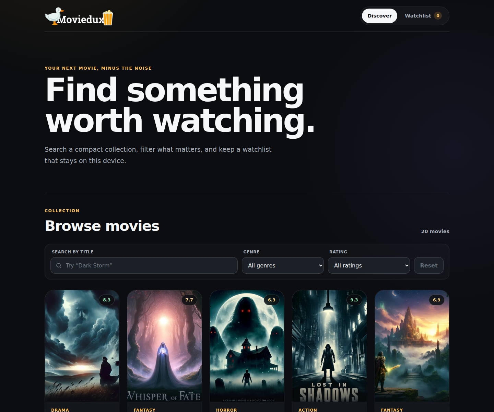
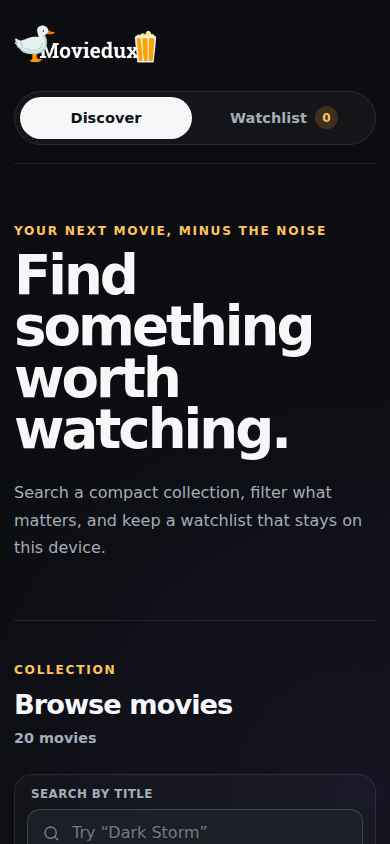
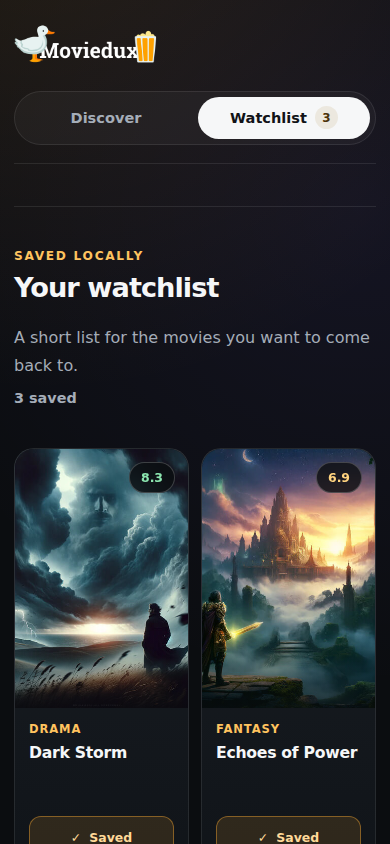

# Moviedux

A deliberately small, polished React movie browser for searching a compact collection, filtering by genre and rating, and keeping a private local watchlist.

**Live demo:** https://moviedux-eight.vercel.app/

[](https://github.com/MykolaDotsenko/moviedux/actions/workflows/ci.yml)

## Screenshots

### Desktop discovery



### Mobile experience

<p align="center">
  
  
</p>

## Why this repository exists

Moviedux started as a 2024 React learning project. The current version intentionally keeps the original product scope small while modernizing the engineering around it: typed domain logic, safe persistence, explicit failure states, responsive UX, accessibility, automated tests, CI, and a current Vite toolchain.

The goal is not to imitate IMDb, TMDB, or a production streaming catalogue. It is to demonstrate that even a small frontend can be implemented with a high engineering floor and clear scope discipline.

## Product scope

- Search movies by title.
- Filter by dynamically derived genres.
- Filter ratings into **Great (8+)**, **Good (5–7.9)**, and **Low (<5)**.
- Add or remove movies from a device-local watchlist.
- Keep watchlist state across reloads when browser storage is available.
- Recover safely from corrupt legacy storage and migrate the original `watchlist` key.
- Show useful loading, error, empty-filter, empty-watchlist, and storage-failure states.
- Preserve SPA navigation for Discover and Watchlist.
- Adapt cleanly from desktop down to narrow mobile layouts.

## Engineering highlights

### Typed data boundary

The bundled movie JSON is treated as untrusted input. Records are normalized before entering application state, malformed values are rejected, duplicate IDs are ignored, and ratings are converted to numbers at the boundary rather than relying on JavaScript coercion.

### Safe local persistence

Watchlist access is isolated behind a versioned storage boundary. Reads and writes are guarded so malformed JSON or unavailable local storage cannot crash the application, and the original `watchlist` key is migrated automatically.

### Accessible responsive UI

The interface uses semantic landmarks, native labels, visible focus states, `aria-pressed`, live result feedback, a skip link, responsive layouts, and `prefers-reduced-motion` support.

### Automated quality gates

Every pull request is checked with:

- ESLint
- Vitest + Testing Library
- strict TypeScript compilation
- Vite production build
- Playwright desktop Chromium
- Playwright mobile Chromium
- axe accessibility scanning
- critical search → save → reload persistence flow
- horizontal-overflow regression check

## Architecture

```text
src/
├── components/       UI and route-level views
├── domain/           movie normalization, filtering and genre derivation
├── hooks/            catalogue loading and watchlist state
├── lib/              versioned local-storage boundary
├── test/             shared test setup
├── App.tsx           routing + application states
└── main.tsx          React bootstrap

e2e/                  browser-level product checks
scripts/              reproducible screenshot capture
docs/screenshots/     README UI evidence
```

The project intentionally avoids a backend, remote movie API, authentication, global state library, and AI layer because the current product scope does not require them.

## Stack

- React 19.3
- TypeScript 6.0
- React Router 7
- Vite 8.3
- Vitest + Testing Library
- Playwright + axe
- ESLint 10
- GitHub Actions
- Vercel

## Local development

Requires **Node.js 22.13+**.

```bash
npm ci
npm run dev
```

## Quality commands

```bash
npm run lint
npm test
npm run build
npm run test:e2e
npm run check
```

For the first local Playwright run:

```bash
npx playwright install chromium
```

To regenerate the README screenshots from a running production preview:

```bash
npm run build
npm run preview
npm run screenshots
```

The screenshot script defaults to `http://127.0.0.1:4173` and can be pointed elsewhere with `SCREENSHOT_URL`.

## Data and privacy

The movie catalogue is bundled as local static JSON. Moviedux does not require an account and does not send watchlist data to a server. Saved movie IDs are stored only in the browser's local storage.

## Scope boundaries

Moviedux is intentionally **not** a TMDB/IMDb clone, recommendation engine, authentication demo, or full-stack application. Adding those features would change the product rather than polish it.

The focus here is a compact frontend with clear behavior, defensive boundaries, measurable accessibility, reproducible testing, and a production deployment that remains easy to reason about.
